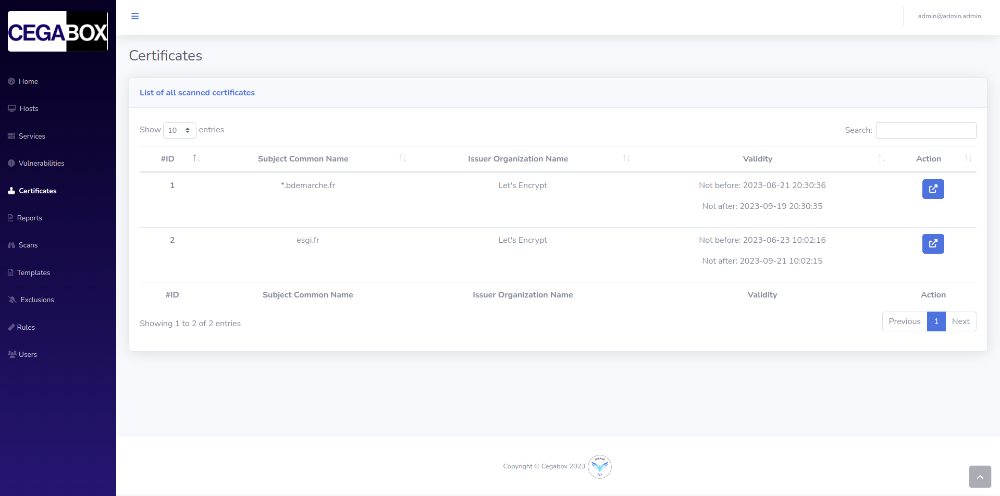

# Frontend

## Summary

1. [Project Presentation](project.html)
2. [How does it work ?](working.html)
3. [Environment](env.html)
4. [**Frontend**](front.html)
   * [Dashboard](front.html)
   * [Scan](scan.html)
   * [Hosts](hosts.html)
   * [Services](services.html)
   * [Vulnerabilities](vulnerabilities.html)
   * [Rules](rules.html)
   * [Reports](reports.html)
   * [**Certificates**](certificates.html)
   * [Templates](templates.html)
5. [Backend](back.html)
6. [Electron](electron.html)
7. [Database](database.html)
8. [Scanner](scanner.html)

### List of all certificates

On this page, you will find all the certificates which has been scanned using the [module](./scanner.html) *Certificate Scanner*

Each entry shown on the table displays the name of the certificate known as the *Subject Common Name*, the *Issuer Common Name* and some actions to perform on it.

### Actions on certificate

#### View certificate

After openning the specific page for a certificate, you will see all the attributes, grouped by topic, such as  the *Subject Informations*, the *Issuers Informations*, the *Validity*, the *Public Key Identifiers*.

Below those four sections, the *X509* section and the *NCT* sections are shown.

Finally, as a service or a vulnerability, the certificate is linked to other elements, such as:

* Report
* Host
* Service
* Vulnerability

[Next Page](templates.html)
