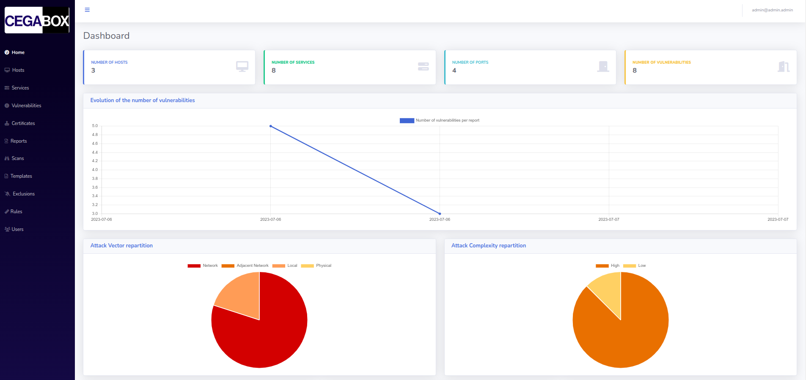
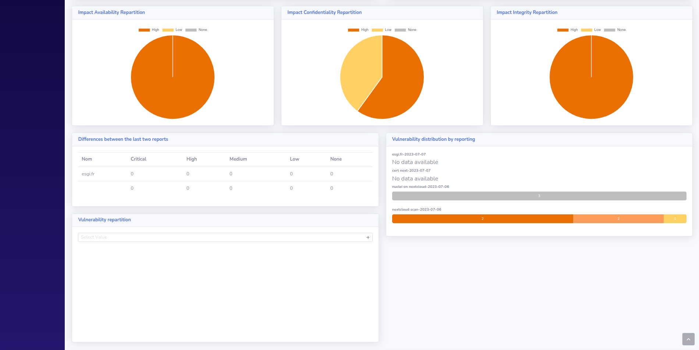

# Frontend

## Summary

1. [Project Presentation](project.html)
2. [How does it work ?](working.html)
3. [Environment](env.html)
4. [**Frontend**](front.html)
   * [**Dashboard**](front.html)
   * [Scan](scan.html)
   * [Hosts](hosts.html)
   * [Services](services.html)
   * [Vulnerabilities](vulnerabilities.html)
   * [Rules](rules.html)
   * [Reports](reports.html)
   * [Certificates](certificates.html)
   * [Templates](templates.html)
5. [Backend](back.html)
6. [Electron](electron.html)
7. [Database](database.html)
8. [Scanner](scanner.html)

The front-end of this project consists in a web interface which users can use to access to thier vulnerabilities reports. They can also see on it all about their hosts, the listening services and open ports and, of course, all associated vulnerabilities.

To make this interface, we did only use HTML, JS and CSS files. All dependencies like stylesheets, source of JS libraries are downloaded locally to make sure that if the **Cegabox** is offline you can still use a nice interface.

All data displayed on the web interface comes from our [API](back.html) which make all requests to the database.

## How to use the web interface ?

### Create an account

First of all, to access the reports, you will need an account. To create it, go to the local website of your **Cegabox** and click on "Create an account".

Then, when your account is created, you could connect and see the dashboard with main informations on it. Good to know, your account always start with "Reader" privileges, if you want to change yours, contact the administrator or if you are the administrator, see our page [Administrate your **Cegabox**](admin.html).

### Dashboard

When you connect, you will always go to this page, it's the main page.

In the right corner, you can see your account and view with which account you are currently connected.

#### Top cards

In the four little top cards, you can see a resume of what have been found on your network, with the number of hosts, services, ports and vulnerabilities.

#### Evolution

With this chart, you can see the trends of your vulnerabilities inside multiple reports. The best design is a downing one which means you have less and less vulnerabilities.

#### Repartitions

##### Attack Vector

With this chart, you should see the repartition within the 4 main attack vectors, which are:

* Network
* Adjacent Network
* Local
* Physical

##### Attack Complexity

With this chart, you should see the repartition for the attack complexity, which could be:

* High
* Low

##### Impact Availability

With this chart, you should see the repartition for the availability impact, which could be:

* High
* Low
* None

##### Impact Confidentiality

With this chart, you should see the repartition for the confidentiality impact, which could be:

* High
* Low
* None

##### Impact Integrity

With this chart, you should see the repartition for the integrity impact, which could be:

* High
* Low
* None

##### Vulnerabilities

With this chart, you could select all reports on which you want to see a vulnerability criticity repartition.

![Cegabox With this chart, you should see the repartition for the integrity impact, which could be:

* High
* Low
* None

#### Differences

This section has the purpose to show you the difference between your two last reports. It will highlights you a colored difference which helps you to understand easily which type of vulnerabilities you have reduce, increase or do not change.

#### Vulnerability Distribution

This section shows you the distributions of your vulnerabilities for all your reports. The reports are reverse order to make sure that the latest one is displayed on top. For each report, we have ponderate it by making this simple rule:

* Criticity **critical**: 16 points
* Criticity **high**: 8 points
* Criticity **medium**: 4 points
* Criticity **low**: 2 points
* Criticity **none**: 1 point

[Next Page](scan.html)
