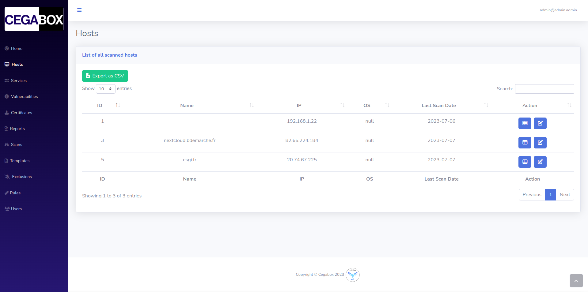
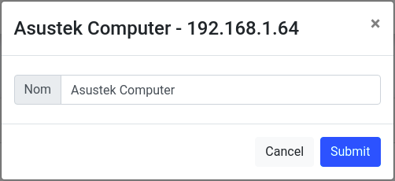
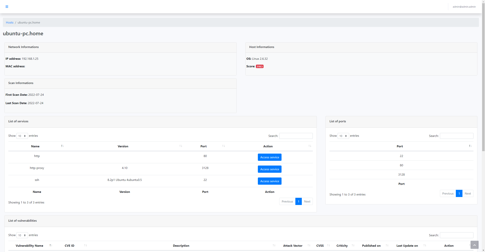
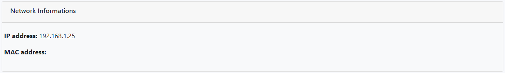
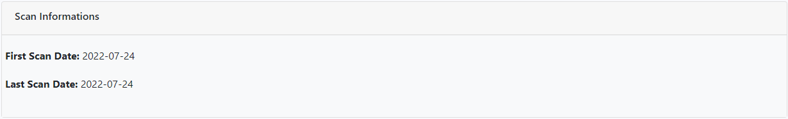
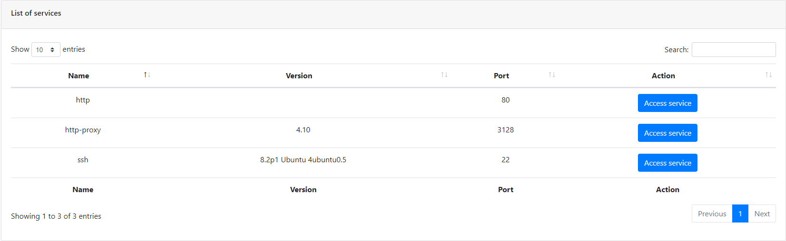
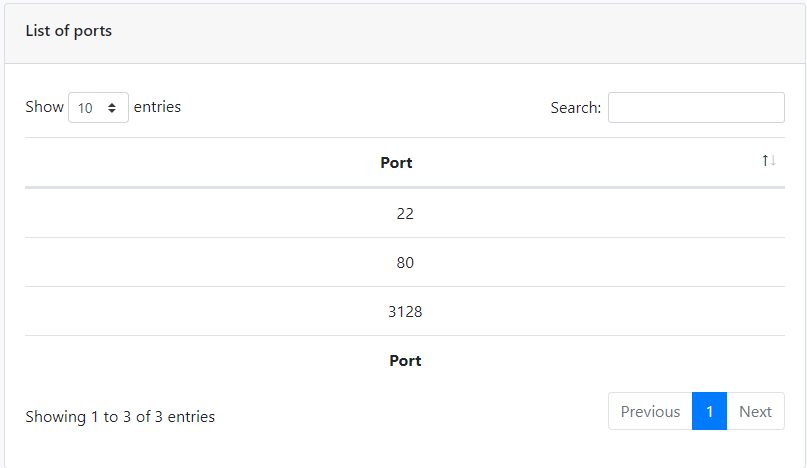
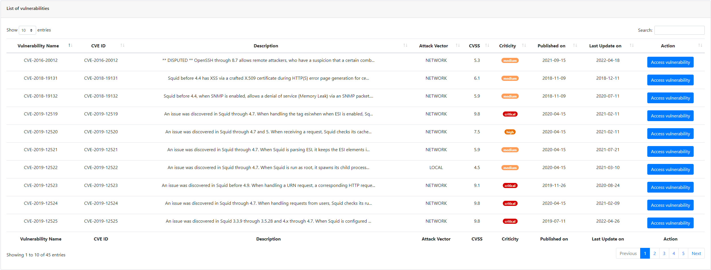
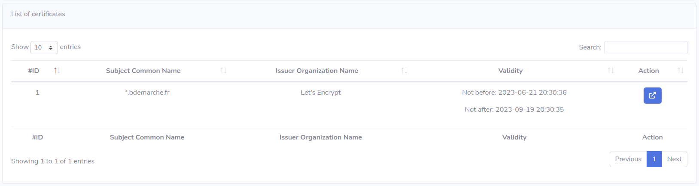

# Frontend

## Summary

1. [Project Presentation](project.html)
2. [How does it work ?](working.html)
3. [Environment](env.html)
4. [**Frontend**](front.html)
   * [Dashboard](front.html)
   * [Scan](scan.html)
   * [**Hosts**](hosts.html)
   * [Services](services.html)
   * [Vulnerabilities](vulnerabilities.html)
   * [Rules](rules.html)
   * [Reports](reports.html)
   * [Certificates](certificates.html)
   * [Templates](templates.html)
5. [Backend](back.html)
6. [Electron](electron.html)
7. [Database](database.html)
8. [Scanner](scanner.html)

### List of all hosts

This page lists all the hosts detected in your network. You have a list that shows you multiple informations about each host of your network like its IP address, its mac address and it could display the Operating System sometimes. Moreover, the last column displays the last date the host has been found in a scan; so that you could see if it was a long time ago.

### Actions on hosts

#### Reader

If you have a "Reader" access on the **Cegabox**, when you are on the hosts page, you could access to the details page for each host belonging a report you could see.

#### Contributor & Administrator

You have the same base of rights than a "Reader".

Furthermore, you could also edit the saved hostname to identify clearly which host is it.

### Host Details

The details page for an host is splitted into 7 sections.

#### 1. Network Informations

In the network informations section, you will find the IP address and the MAC address for the host.

#### 2. Host Informations

In the host informations section, you will find the detected OS and the vulnerability score for this host.

#### 3. Scan Informations

In the scan informations section, you will find the first and last date of scan.

#### 4. List of services

In the list of services, you will find all scanned and detected services running on the host.

#### 5. List of ports

In the list of ports, you will find all ports which are opened and running for services.

#### 6. List of vulnerabilities

In the list of vulnerabilities, you will find all found vulnerabilities for the host.

#### 7. List of certificates

In the list of certificates, you will all certificates that were accessible in the services running on the host.

[Next Page](services.html)
