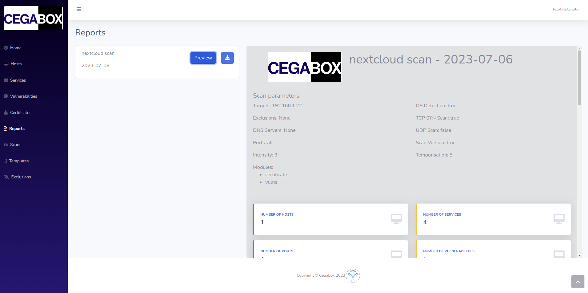
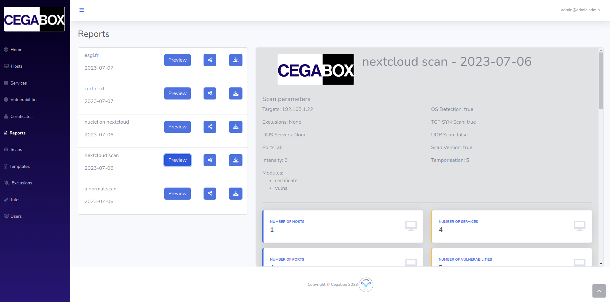
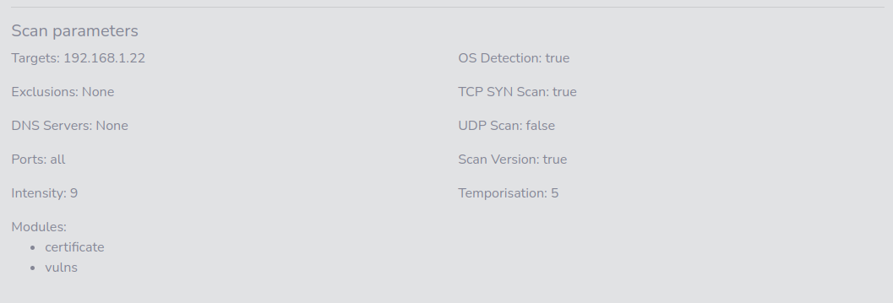
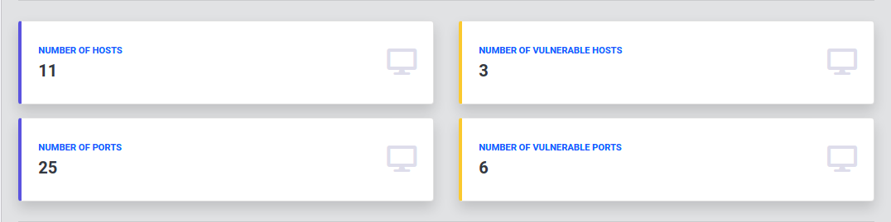
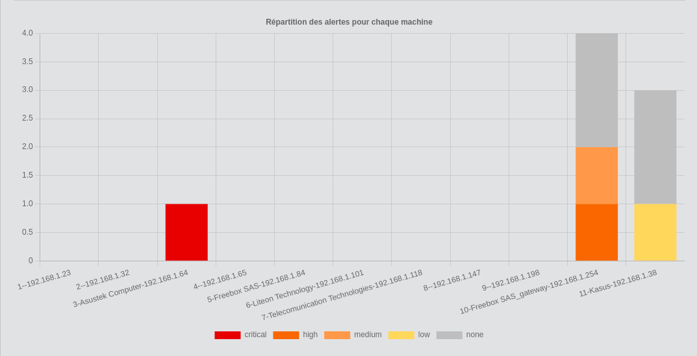
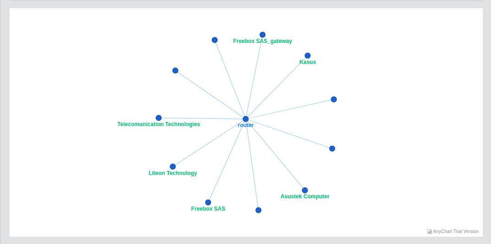
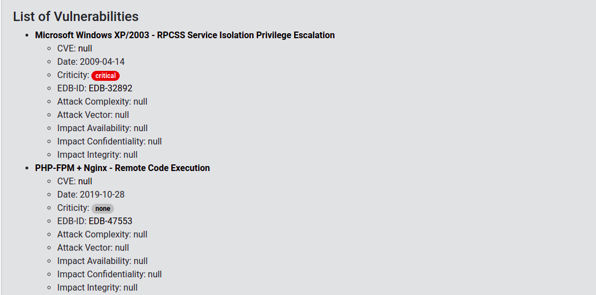
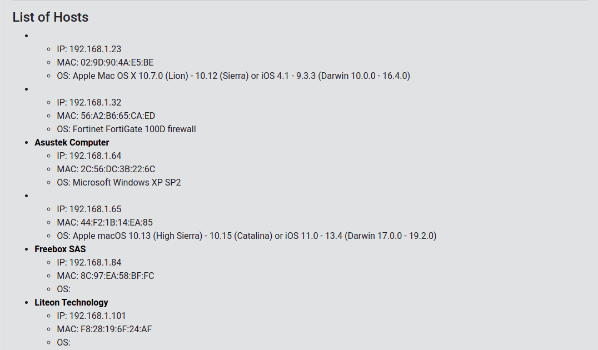
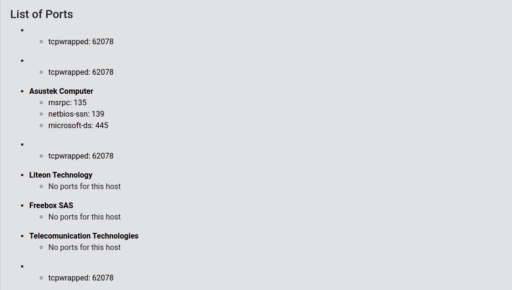

# Frontend

## Summary

1. [Project Presentation](project.html)
2. [How does it work ?](working.html)
3. [Environment](env.html)
4. [**Frontend**](front.html)
   * [Dashboard](front.html)
   * [Scan](scan.html)
   * [Hosts](hosts.html)
   * [Services](services.html)
   * [Vulnerabilities](vulnerabilities.html)
   * [Rules](rules.html)
   * [**Reports**](reports.html)
   * [Certificates](certificates.html)
   * [Templates](templates.html)
5. [Backend](back.html)
6. [Electron](electron.html)
7. [Database](database.html)
8. [Scanner](scanner.html)

### List of reports

#### Reader

In this list, you can find all the reports shared to you, download them in a JSON file. You have also the possibility to preview the report you want and see by this way an analysis of it.

#### Contributor & Administrator

In this list, you can find all the reports shared to you, download them in a JSON file and share them with other users which have to "Reader" role. You have also the possibility to preview the report you want and see by this way an analysis of it.

### Report preview

In the second main part of your screen, you could see the content of the report and the analysis made of it.

### Report parameters

In this section about scan data, you will find all the parameters that you set up when you were creating your scan.

#### Report resume

In the first section of the report, you could find a reminder of what the scan detected, like the hosts, the ports and, of course, the vulnerabilities.

#### Criticity chart

In a second section, you will find chart which is highlighting for each hosts what are its vulnerabilities, group by criticity.

#### Network topology

In the third section of the report, you could finda network topology based on the hosts responding on your network

#### List of vulnerabilities

In this section, you will find the list of all vulnerabilities detected on your infrastructure.

#### List of hosts

In this section, you will find the list of all hosts detected on your infrastructure.

#### List of ports

In this section, you will find the list of all ports detected on your infrastructure.

[Next Page](certificates.html)
