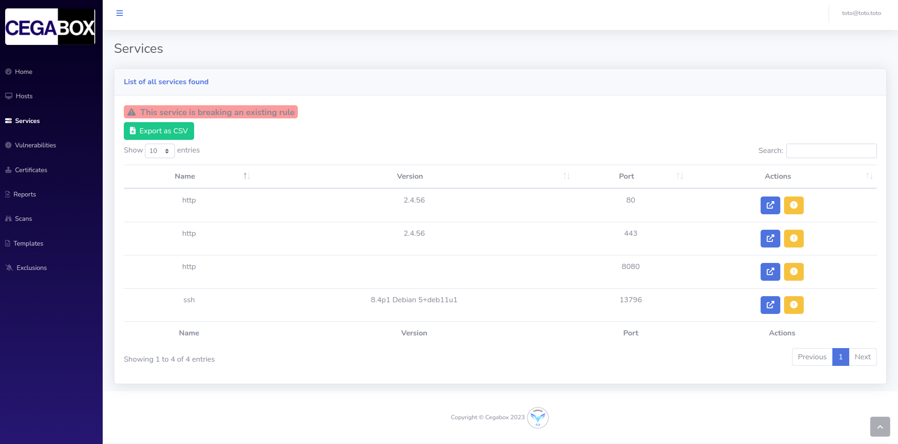

# Frontend

## Summary

1. [Project Presentation](project.html)
2. [How does it work ?](working.html)
3. [Environment](env.html)
4. [**Frontend**](front.html)
   * [Dashboard](front.html)
   * [Scan](scan.html)
   * [Hosts](hosts.html)
   * [**Services**](services.html)
   * [Vulnerabilities](vulnerabilities.html)
   * [Rules](rules.html)
   * [Reports](reports.html)
   * [Certificates](certificates.html)
   * [Templates](templates.html)
5. [Backend](back.html)
6. [Electron](electron.html)
7. [Database](database.html)
8. [Scanner](scanner.html)

### List of all Services

This page lists all the services detected in your network. You have a list that shows you multiple informations about each port of your network like the service name, the detected version and the opened port. For each service, you could access to the detailled view or create an [alerting rule](rules.html).

### Service Details

The detailled view for a service is splitted into 4 sections.

#### 1. Service Informations

In this section, you could see the main informations for this service, such as the name, the detected version and the opened port. The combination of these 3 parameters makes it unique and only existing once in the database.

#### 2. List of hosts

In this section, you would find all the hosts which are running this service.

#### 3. List of vulnerabilities

In this section, you would find all the vulnerabilities which have been detected on the service.

#### 4. List of certificates

In this section, you would find all the vulnerabilities which have been detected on the service.

[Next Page](vulnerabilities.html)
